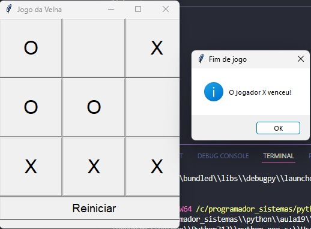

# Jogo da Velha Tkinter

## Projeto Desenvolvido para estudos
---

###  Demonstração:



---

## Sobre o Projeto

Objetivo:

- Praticar manipulação de matrizes e listas com Python
- Entender como manipular elementos com Tkinter
- Fazer uma GUI funcional do classico Jogo da Velha

---

## Tecnologias Usadas

- [x] Python 
- [x] Tkinter

---

## Como Rodar o Projeto

```bash
# Clone o repositório
git clone https://github.com/peter-bueno/Jogo-Da-Velha-Tkinter.git


# Rode a main
py main.py
